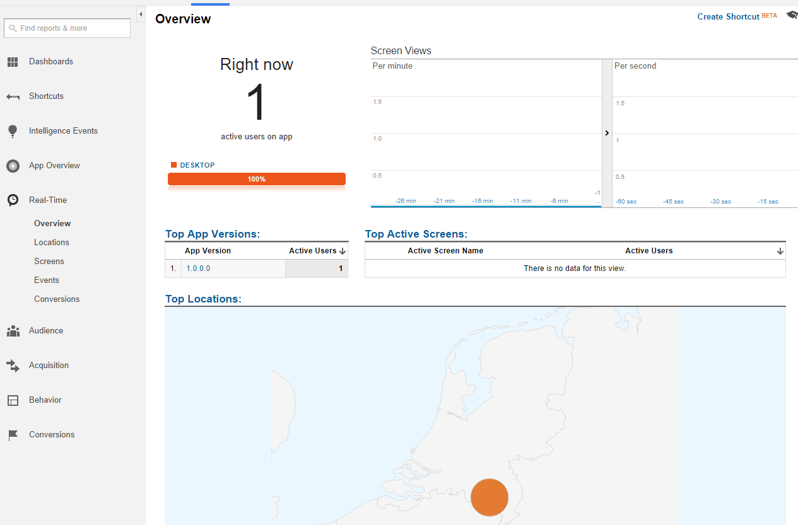

# Orc.Analytics

This library makes it very easy to integration Google Analytics with Catel projects.

  

# Initializing the service

Initializing the service is really easy. It tries to get as much information as possible, but all properties can be changed accordingly. The service is automatically registered in the Catel service locator. 

Use the code to initialize the service by letting the service injected into a view model or resolve it manually from the service locator, then call this code:

    googleAnalyticsService.AccountId = AccountId;

# Customizing user ID

The user id is retrieved from the *IUserIdService*. By default, it uses a combination of the CPU id and the HDD id and hashes a combination of these 2 so they cannot be traced back to the user.

It can be customized by creating a custom *IUserIdService* or by setting the *UserId* property manually on the *IGoogleAnalyticsService*.

# Sending data

You can send data to Google Analytics with several calls. Below are all the calls explained separately.

## SendView

Use the following method:

    public async Task SendView(string viewName);

## SendEvent

Use the following method:

    public async Task SendEvent(string category, string action, string label = null, long value = 0);

## SendTransaction

Use the following method:

    public async Task SendTransaction(string sku, string name, string transactionId, long costPerProduct, int quantity = 1);

## SendTiming

Use the following method:

    public async Task SendTiming(TimeSpan time, string category, string variable, string label = "")